# Шолков Егор КМБ-2 Лабораторная №1

# Задание 1.  Генерация списков

## Задача 12

### Текст задачи

Сформировать список из чисел, на 1 больших, чем вводимые значения.

### Алгоритм решения

1. Входные данные : inputData - строковый тип данных, который является вводимым значением

2. Выходные данные : resList - итоговый список из чисел, на 1 больших, чем вводимые значения

3. Логика работы : 
	1. Программа передает из main в рекурсивную функцию makeList пустой список, в котором будут накапливаться вычисленные значения 
	
	2. Запрос вводимого значения от пользователя (в строковом типе). Строковая переменная inputData инициализируется результатом выполнения Console.ReadLine()
	
	3. Проверка корректности ввода через конструкцию Pattern matching:
		
		1. если было введено некорректное значение(которое нельзя привести к типу данных int), то функция рекурсивно вызывает себя для повторного ввода. 
		
		2. если было введено корректное значение (которое можно привести к типу данных int через парсинг, используя System.Int32.TryParse(n), где значение n - это псевдоним значения inputData), то к концу имеющегося списка при помощи @ присоединяется список, состоящий из конвертированного в int значения, который на 1 больше изначально вводимого значения (convVallue + 1). Конвертированное значение convValue получается после успешного парсинга через System.Int32.TryParse(n), где в результате возвращается кортеж из двух значений (возможность преобразования (true/false), приведенное к нужному типу значение при успешной операции)
		
		3. если была нажата клавиша **ENTER** (пустая строка ""), то функция завершает работу(попадает в базовый случай рекурсии) и возвращает итоговый (накопленный на момент вызова) список  значений currList обратно в main
	
	4.По завершении своей работы функция возвращает итоговый список значений и выводится на экран. Результат работы сохраняется в значении resList и выводится с помощью printfn 

### Тестирование

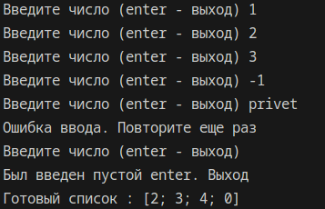

# Задание 2. Рекурсия

## Задача 12

### Текст задачи

Найти произведение нечётных цифр натурального числа

### Алгоритм решения

1. Входные данные -  inputString — строковый тип данных, вводимый пользователем 

2. Выходные данные - multiplication — целочисленный результат произведения всех нечетных цифр натурального числа

3. Логика работы : 
	1. Из main вызывается функция chekInputData для запроса входных данных  у пользователя и дальнейшего подсчета произведения нечетных цифр натурального числа с проверкой на корректность ввода. Введенные пользователем данные сохраняются в значение inputString

	2. Проверка корректности ввода через конструкцию Pattern matching:
		
		1. если была нажата клавиша **ENTER** (пустая строка ""), то программа завершает свою работу 
		
		2. вводимое значение inputString передается в функцию isNatruralInteger, которая возвращает тип данных bool 
		
			1. Проверка принадлежности вводимого пользователем значения к множеству натуралных чисел через использование System.Int32.TryParse(inputStr) :
			
				1. если можно привести введенную пользователем строку к типу данных int и оно натуральное (convertedStr > 0, convertedStr получилось при успешной операции Try.Parse), то осуществляется вызов рекурсивно функции findMultiplication для вычисления произведения нечетных цифр числа с аргументами inputData(преобразованное в int inputString) multiplication (по умолчанию 1 ) hasOneOddDigit (false, служит для проверки, что в числе есть хотя бы одна нечетная цифра)
				
					1. Рекурсивное вычисление произведения нечетных цифр натурального числа :
					
						1. базовый случай, если достигнут 0 и изначальное число имело хотя бы одну нечетную цифру, то возвращается накопленное произведение(multiplication), если достигнут 0, но не было найдено хотя бы одной нечетной цифры, то возвращается 0 
					
						2. если n  (псевдоним вводимого значения) нечетный (опредеятется через функцию isOdd), то рекурсивно вызывается функция  findMultiplication с параметрами (n / 10) (multiplication * findLastDigit n) true, где n/10 это последняя цифра числа, к произведению домножается последняя цифра нечетного числа через функцию findLastDigit, флаг true - есть хотя бы одна нечетная цифра
					
						3. иначе рекурсивно вызывается findMultiplication c параметрами  (n / 10) multiplication oddStatus, где n/10 - последняя цифра числа, oddStatus - флаг наличия нечетной цифры 
	
				2. если ввод некорректен (не является натруальным после вызова функции isNaturalInteger) , то выводится сообщение об ошибке, и функция checkInputData рекурсивно вызывает саму себя для повторного ввода

### Тестирование

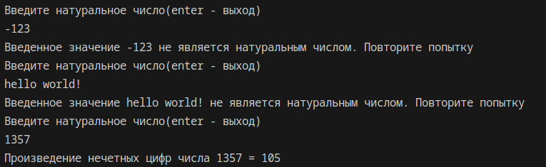
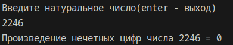

# Задание 3.  

## Задача 2
## Текст задачи

Создайте собственные функции для выполнения основных операций над списками (добавление/
удаление/поиск элемента, сцепка двух списков, получение элемента по номеру).

### Алгоритм решения

1.  Входные данные: inputList — начальный список ; choiseNumber — код выбранной операции( пользовательский ввод для параметров каждой операции)

2. Выходные данные: resultList — измененный список после выполнения выбранных действий

3. Логика работы : 
	
	1. Управление программой для выбора нужно операции (Функция choice):
	
		1.  Программа реализует интерактивное меню через рекурсивную функцию choice. С помощью конструкции Pattern Matching анализируется ввод пользователя. При выборе чисел «1»–«5» вызывается соответствующая функция работы со списком (addElList, delElList, findElList, mergeLists, getElList) , при вводе «0» — рекурсия завершается, и итоговый список возвращается в main. Присутсвует проверка на корректность ввода выбранной операции (если будет выбрано что-то помимо 0 - 5, программа рекуривно вернется к выбору нужной операции)
	
	2. Добавление :  addElList cчитывает строку в значение temp и упаковывает её в список. С помощью оператора **`@`** выполняет конкатенацию inputList и temp, возвращая расширенный список с добавленным элементом
	
	3. Удаление  : delElList пользователь вводит значение temp (удаляемый элемент списка). Основная логика реализована во внутренней функции delEl, которая разделяет список на голову (head) и хвост (tail). С помощью конструкции when head = delTarget проверяется совпадение текущего элемента с удаляемым. Если совпадение найдено, элемент пропускается и возвращается хвост списка. Если совпадения нет, голова сохраняется и функция рекурсивно обрабатывает хвост. Базовый случай рекурсии — пустой список [], который возвращается, если искомый элемент не найден.
	
	4. Поиск элемента : findElList запрашивает искомое значение в значение target. Рекурсивная функция listEl выполняет обход списка, сравнивая каждый элемент head с искомым значением. Если соответствие найдено, функция возвращает список из одного этого элемента [head]. Базовом случай - [], совпадений не обнаружено, функция возвращает пустой список. 

	5. Сцепка двух списков : mergeLists запрашивает значение tempListLength (длина второго списка) для генерции списка, с которым будет происходить сцепка. Через генератор списков (for...yield) создается новый список tempList, заполняя его значениями кратными 10 (i×10). Возвращает результат слияния inputList @ tempList
	
	6. Получение элемента по номеру : getElList считывает порядковый номер в значение targetNumber. Для предотвращения ошибок ввода используется метод System.Int32.TryParse(targetNumber), который возвращает результат проверки в конструкции match. При успешном парсинге вызывается рекурсивная функция findElByIndex, которая принимает текущий список и числовой индекс(targetIndex). На каждом шаге рекурсии индекс уменьшается на 1 (targetIndex - 1), пока не станет равным 1, что соответствует нахождению нужного элемента. Если индекс превышает длину списка или введен некорректно, возвращается пустой список [].

	7. По завершении своей работы функция возвращает итоговый список значений и выводится на экран. Результат работы сохраняется в значении resList и выводится с помощью printfn  
    
### Тестирование

Скриншоты результата работы программы
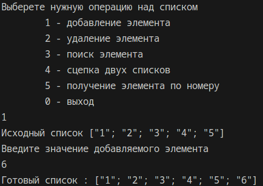
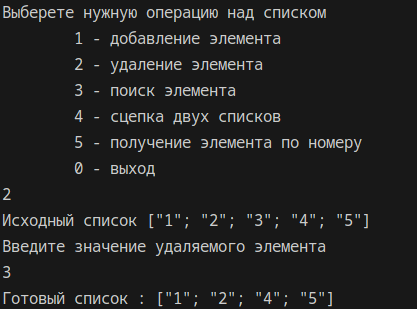
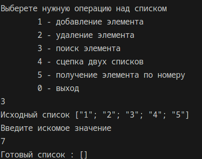
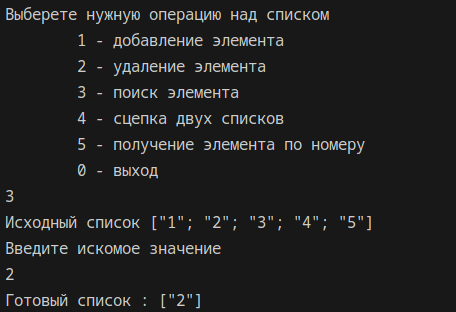
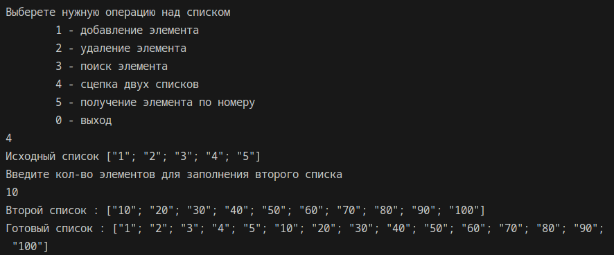
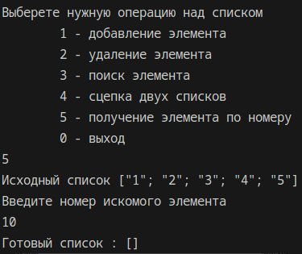
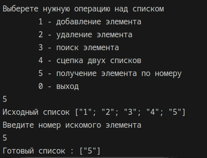
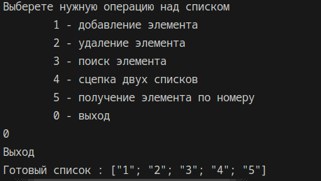
